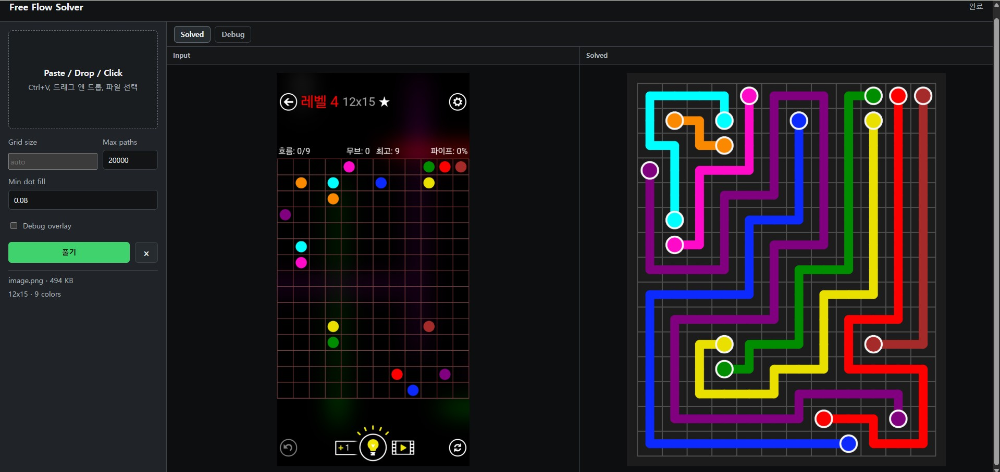

# Free Flow 캡처 풀이기

Free Flow 문제 화면을 캡처해서 넣으면, 보드 격자와 색상 원을 자동으로 인식하고 퍼즐을 풀어 해답 이미지를 만들어 주는 Python 도구입니다. 웹 UI와 CLI를 둘 다 제공합니다.



## 주요 기능

- 스크린샷에서 보드 영역 자동 검출
- 정사각형 보드와 직사각형 보드 자동 인식
- 색상 원 쌍 자동 매칭
- 큰 보드는 Z3 기반 solver로 풀이
- 풀이 결과 PNG 생성
- 인식 상태를 확인할 수 있는 Debug overlay 제공
- 로컬 웹 UI에서 붙여넣기, 드래그 앤 드롭, 파일 선택 지원

## 설치

Python 3.11 기준으로 확인했습니다.

```powershell
pip install -r requirements.txt
```

설치되는 주요 패키지는 다음과 같습니다.

- `opencv-python`: 이미지 처리, 보드/원 검출
- `numpy`: 이미지 배열 처리
- `z3-solver`: 큰 보드 풀이 엔진

## 웹 UI 실행

```powershell
python web_app.py
```

실행 후 브라우저에서 아래 주소를 엽니다.

```text
http://127.0.0.1:8000
```

사용 흐름:

1. Free Flow 문제 화면을 캡처합니다.
2. 웹 UI에 이미지를 붙여넣거나 드래그 앤 드롭합니다.
3. `풀기`를 누릅니다.
4. 오른쪽 출력 패널에서 해답 이미지를 확인합니다.

## UI 옵션

`Grid size`

기본값은 `auto`입니다. 보통 비워두면 됩니다. 자동 인식이 틀릴 때만 `7`, `11x11`, `12x15`처럼 직접 입력합니다.

`Max paths`

DFS fallback solver에서 색상별 후보 경로를 최대 몇 개까지 만들지 정하는 값입니다. 현재 큰 보드는 Z3 solver를 사용하므로 대부분의 큰 퍼즐에서는 이 값이 직접적인 영향을 주지 않습니다.

`Min dot fill`

각 cell 중심부를 원형으로 샘플링했을 때, 그 안에 점으로 보이는 픽셀이 최소 몇 비율 이상 있어야 endpoint로 인정할지 정하는 값입니다. 기본값 `0.08`은 8% 이상이면 점으로 본다는 뜻입니다.

`Debug overlay`

해답 대신 인식 결과를 보여줍니다. 보드 crop, 격자선, endpoint 위치, 색상쌍 라벨을 확인할 수 있어서, 풀이 실패가 이미지 인식 문제인지 solver 문제인지 구분할 때 씁니다.

## CLI 사용

기본 사용:

```powershell
python freeflow_solver.py input.png -o solved.png
```

디버그 이미지도 같이 저장:

```powershell
python freeflow_solver.py input.png -o solved.png --debug debug.png
```

보드 크기를 수동 지정:

```powershell
python freeflow_solver.py input.png -o solved.png --grid-size 11x11
python freeflow_solver.py input.png -o solved.png --grid-size 12x15
```

## 문제 해결

점이 빠지거나 색상쌍 수가 맞지 않는 경우:

- 웹 UI에서 `Debug overlay`를 켜고 인식 결과를 확인합니다.
- 흰색/회색 점이 빠지면 `Min dot fill`을 낮춰 봅니다.
- 배경 노이즈가 점으로 잡히면 `Min dot fill`을 높여 봅니다.

격자 크기가 틀린 경우:

- `Grid size`에 `11x11`, `12x15`처럼 직접 입력합니다.
- 화면이 심하게 기울어진 캡처는 피하는 편이 좋습니다.

풀이가 오래 걸리는 경우:

- 큰 보드는 Z3 solver가 처리합니다.
- 작은 보드에서만 `Max paths`를 낮추면 DFS fallback 탐색량을 줄일 수 있습니다.

## 현재 파일 구성

```text
C:\03_freeflow
├─ assets/
│  └─ flow-overview.svg
├─ freeflow_solver.py
├─ web_app.py
├─ requirements.txt
└─ README.md
```
